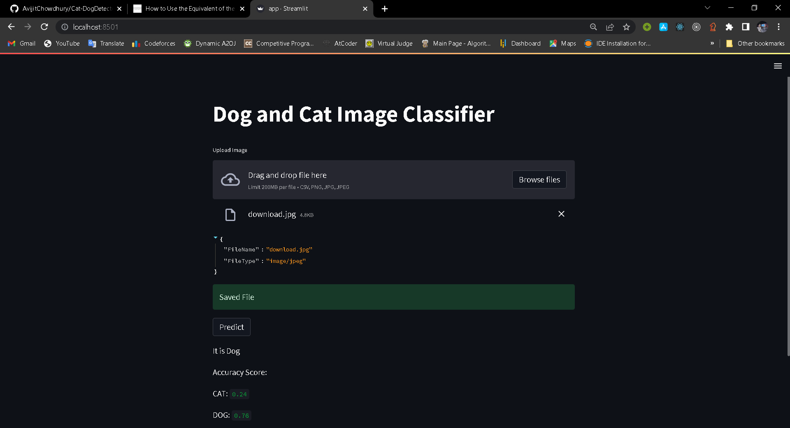

<html>

<body>
<h1>Cat & Dog Detector: </h1>
<h2>cat dog neural network implemented into website using flask</h2>

Convolutional Neural Network (CNN) is an algorithm taking an image as input and then assigning weights and biases to all the aspects of an image and thus differentiates one from the other. Neural networks can be trained by using batches of images, each of them having a label to identify the real nature of the image (cat or dog here). A batch can contain a few tenths to hundreds of images. For each and every image, the network prediction is compared with the corresponding existing label, and the distance between the network prediction and the truth is evaluated for the whole batch. Then, the network parameters are modified to minimize the distance and thus the prediction capability of the network is increased. The training process continues for every batch similarly. The main goal of this project is to develop a system that can identify images of cats and dogs. The input image will be analyzed and then the output is predicted. The model that is implemented can be extended to a website or any mobile device as per the need. The Dogs vs Cats dataset can be downloaded from the Kaggle website. The dataset contains a set of images of cats and dogs. Our main aim here is for the model to learn various distinctive features of cats and dogs. Once the training of the model is done it will be able to differentiate images of cats and dogs.

<h1>Libraries Used: </h1>
<ul>
<li>Numpy</li>
<li>Pandas</li>
<li>Matplotlib</li>
<li>tensorflow</li>
<li>keras</li>
<li>flask</li>
</ul>
<h1><b>WorkFlow</b></h1>

<ol>
<li>Data Preprocessing</li>
<li>Rescale & assign categorical designs</li>
<li>CNN Model</li>
<li>Splitting Data Into Training and Test Set</li>
<li>Visulazing Dataset and Determining Training Loss</li>
</ol>

<video width="320" height="240" controls src="./files/smsSpamDetector.mp4">
  <source src="projectOverview/demo.mp4" type="video/mp4">
Video: 
</video>
<a href="https://cat-dogimagepredictoravijit.herokuapp.com/">Livelink</a>
<a href="#">Custom Dataset</a>
<h2>For Running This Project in your computer,please follow this steps</h2>
<ol>
<li>cd main</li>
<li>conda create -p venv python -y</li>
<li>conda activate COPY_THE_VENV_PATH</li>
<li>pip install -r requirements.txt</li>
<li>streamlit run app.py</li>
</ol>
</body>

</html>
